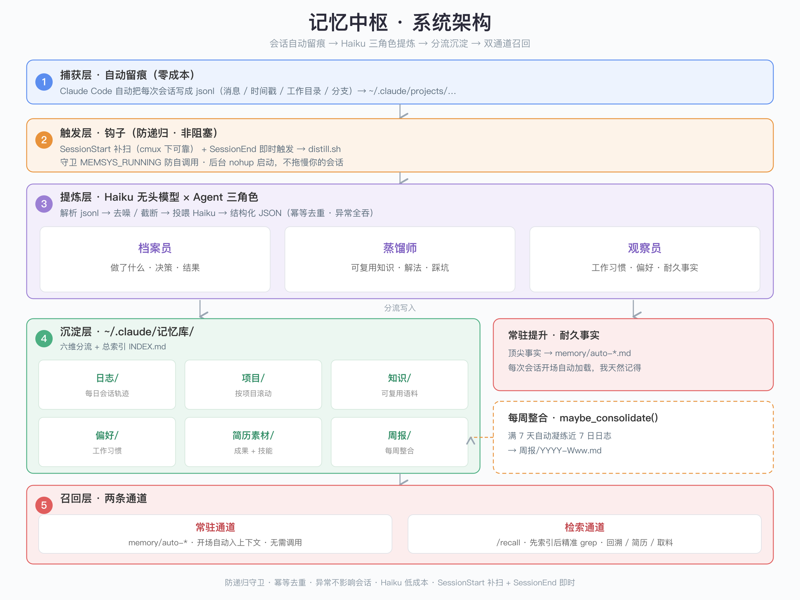

# diagram-generator · 一句话让 AI 画架构图

把"画图的审美"固定成一套规则——你只描述**结构**(分几层、谁连谁、什么关系),AI 按规则生成 SVG,再转成**高清 PNG**。架构图、流程图、关系图、对比图都能画。

再也不用在 PPT 里一个个拖框、对齐、调色。

> 上面这张架构图,我只描述了"五层结构 + 每层干啥",**布局 / 对齐 / 配色全是它生成的**。

## 能画什么

- **架构图** — 系统架构、模块关系、技术栈
- **流程图** — SOP、审批流、数据流向
- **关系图** — 实体关系、层级结构、组织架构
- **对比图** — 方案 / 版本对比
- 任何"需要把结构讲清楚"的图

## 怎么用

1. 把本目录的 `SKILL.md` 挂到 Claude Code / Cursor 等(作为 skill 或 rule),或直接把它的内容贴给 AI 当系统提示。
2. 跟 AI 说需求,例如:
   > 画一张架构图,包含 捕获 / 触发 / 提炼 / 沉淀 / 召回 五层,自上而下,深色色条区分,右下署名。
3. AI 产出 SVG,并用 Node.js + `sharp` 转成高清 PNG。

**环境**:Node.js + `sharp`(`npm install sharp`)。Python 不可用时一律走 Node 方案。

## 设计原则(为什么出来的图不丑)

- 信息层级自上而下:标题 → 阶段条 → 主体 → 产出 → 署名
- 同层模块严格对齐、等宽分布,坐标用公式算不靠手估
- 配色固定一套、有意义;留白克制;连线简洁不交叉
- 文字一律 `<text>`(兼容性好),高清靠 density≥200 + 输出 ≥ viewBox 2 倍

完整规则、SOP、配色方案、避坑清单见 **[SKILL.md](SKILL.md)**。

## License

MIT
